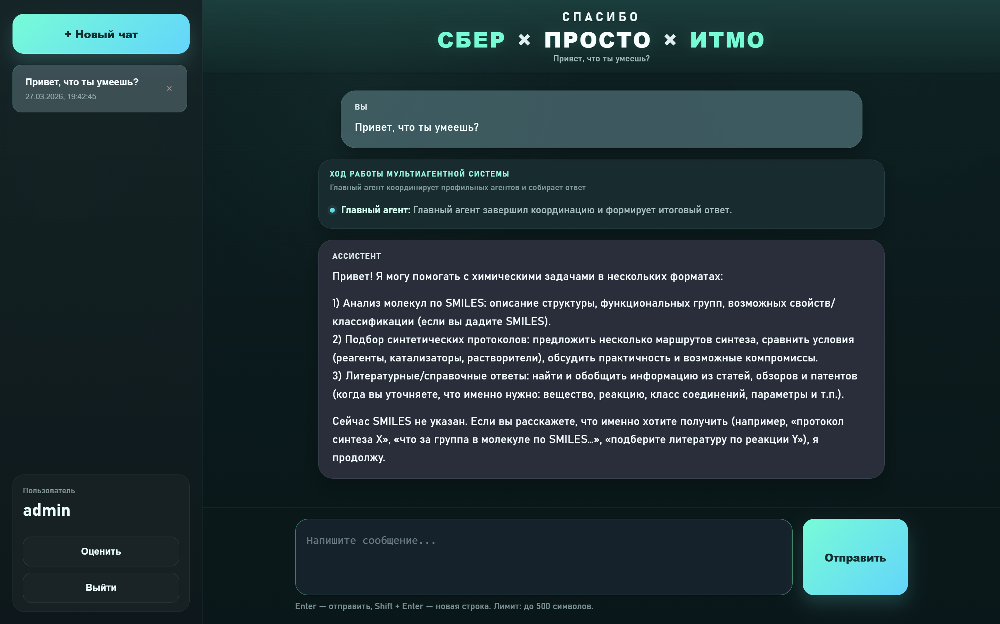
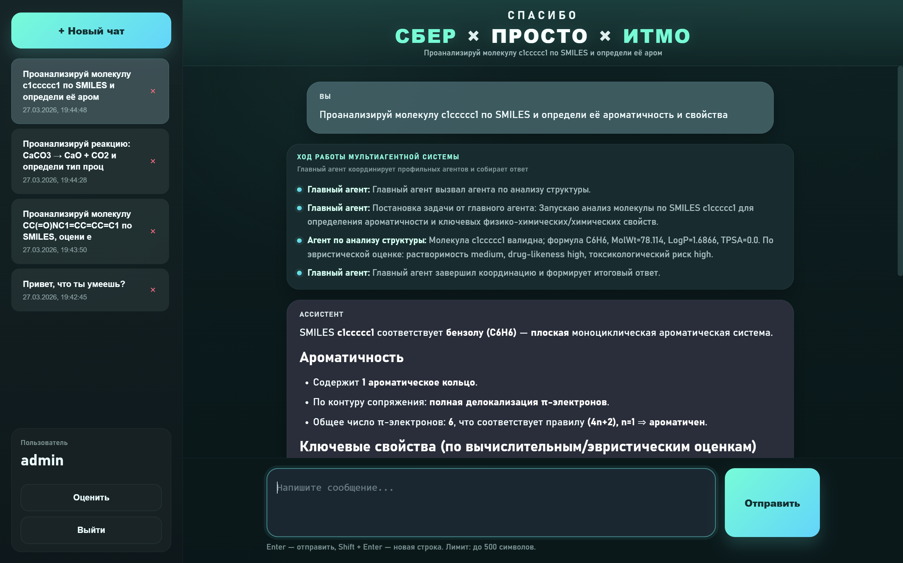
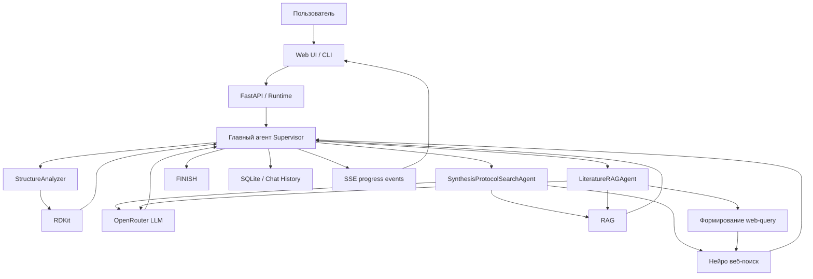

# Hackathon_MultiAgent_system
It-хакатон Сбер х Просто х Итмо мультиагентный ассистент химика-органика для планирования синтеза в лаборатории

[Официальный сайт хакатона prostospb.team](https://www.prostospb.team/hackathon-26#4)

## Overview

**Hackathon_MultiAgent_system** — это мультиагентная система с веб-интерфейсом, которая объединяет оркестрацию через LLM, специализированных агентов, локальный RAG и нейро-веб-поиск в одном продукте. Пользователь отправляет обычный текстовый запрос, а система сама определяет, какой сценарий обработки нужен: детерминированный анализ структуры, поиск методик, работа с локальной базой знаний или поиск актуальной информации в интернете.

Проект включает:
- **мультиагентный оркестратор**, который маршрутизирует запросы между профильными агентами;
- **специализированных агентов** под разные классы задач;
- **локальную RAG-систему** по химическим учебникам, справочным материалам и методическим документам;
- **нейро веб-поиск** для получения актуальной информации из интернета;
- **веб-приложение** с чатами, историей, сохранением контекста и отображением промежуточных шагов работы системы.

Система поддерживает как **CLI-режим**, так и **полноценный веб-интерфейс**. В веб-версии пользователь может логиниться, создавать несколько чатов, возвращаться к старым диалогам и видеть не только итоговый ответ, но и ход работы мультиагентного пайплайна.

---

## Demo

  
  

Подробные примеры и тесты работы системы доступны в файле:

[web_demo.pdf](web-demo/web_demo.pdf)


## Quick start (setup and launch)


### API ключи

<table>
  <tr>
    <th>Сервис</th>
    <th>Назначение</th>
    <th>Как получить</th>
  </tr>
  <tr>
    <td><b>OpenRouter</b></td>
    <td>Доступ к LLM (Агенты, RAG)</td>
    <td><a href="https://openrouter.ai/">openrouter.ai</a></td>
  </tr>
  <tr>
    <td><b>SerpAPI</b></td>
    <td>Веб-поиск (Google Search API)</td>
    <td><a href="https://serpapi.com/">serpapi.com</a></td>
  </tr>
</table>

> Далее заполнить их в .env файл (см .env.example)


### Зависимости и инстурменты
**Python 3.11** и выше.  
1. #### Создание среды и установка requirements
```bash
python -m venv venv
cd .\venv\Scripts\
.\activate.bat
pip install -r requirements.txt
```


### Запуск сервера
```bash
python -m uvicorn api.main:app --host 127.0.0.1 --port 8000
```


## Архитектура и реализация системы

### 1. Архитектура

Система построена как **мультиагентный граф исполнения**, где главный агент принимает решение, какой профильный агент должен обработать запрос, а затем собирает итоговый ответ. Входом может быть как CLI-запрос, так и сообщение из веб-чата.



Где что находится:
- `api/` — серверная точка входа и HTTP API;
- `webui/` — интерфейс чата;
- `src/MAS/orchestrator/agent_orchestrator.py` — граф оркестрации и логика `Supervisor`;
- `src/MAS/agents/` — профильные агенты;
- `src/RAG/` — локальная retrieval-подсистема;
- `src/NeuralSearch/` — веб-поиск и обработка интернет-источников;
- `src/webapp/` — работа с чатами, SSE и SQLite-хранилищем.

### 2. Главный агент и профильные агенты

В центре системы находится **главный агент (`Supervisor`)**, который:
- получает пользовательский запрос;
- нормализует рабочее состояние;
- определяет, какого профильного агента нужно вызвать;
- отслеживает историю шагов и результаты предыдущих вызовов;
- завершает выполнение и формирует итоговый ответ.

В проекте реализованы три профильных агента:

**`StructureAnalyzer`**
- отвечает за анализ молекулы по SMILES;
- извлекает и валидирует SMILES;
- вычисляет дескрипторы через RDKit;
- формирует интерпретируемое химическое резюме без обязательной зависимости от LLM.

**`SynthesisProtocolSearchAgent`**
- ищет и структурирует методики и маршруты синтеза;
- использует LLM, retrieval-инструменты и постобработку результата;
- приводит найденные маршруты к единому JSON-формату;
- ранжирует варианты и помогает выбрать наиболее практичный маршрут.

**`LiteratureRAGAgent`**
- отвечает за справочные, литературные и актуальные интернет-запросы;
- умеет выбирать backend поиска;
- для веб-поиска сначала формирует короткий поисковый запрос, а затем передаёт его в pipeline;
- может работать как с локальным retrieval-контекстом, так и с ответом из web-search.

### 3. RAG-система

RAG-подсистема обеспечивает извлечение информации из локальной базы знаний, включающей **методические и справочные указания, а также учебники по химии**. Суммарно в индексе находится порядка **3000 страниц PDF-документов**.

#### Индексация

PDF-документы проходят предварительную обработку:

* парсинг-извлечение текста (с OCR);
* восстановление структуры;
* обработка таблиц;
* очистка от артефактов.

Документы сохраняются в структурированном JSON-формате с постраничным представлением.

#### Секционирование

Для более ориентированного поиска по базе знаний документы разбиваются на смысловые разделы на основе:

* заголовков;
* нумерации;
* структурных признаков.

> При отсутствии явной структуры используется fallback-разбиение на окна страниц.

Далее для каждого раздела выполняется его суммаризация с помощью LLM-модели. Это позволяет сначала искать по секциям, а затем уточнять ответ по чанкам.

#### Чанкинг

Разделы разбиваются на небольшие текстовые фрагменты:

* размер: ~300 токенов;
* перекрытие: ~50 токенов.

При тестировании было выявлено, что такие параметры дают хороший баланс между точностью поиска и сохранением контекста.

#### Эмбеддинги и индексы

Для всех чанков и секций вычисляются эмбеддинги с использованием модели **BAAI/bge-m3**. Данные сохраняются в **FAISS-индексах**:

* индекс секций;
* индекс чанков.

#### Retrieval pipeline

Поиск выполняется в несколько этапов:

1. Поиск релевантных секций;
2. Уточнение на уровне чанков;
3. Восстановление страниц документа;
4. LLM-реранкинг;
5. Формирование финального контекста.

Ответ генерируется строго на основе найденных данных.

### 4. Нейро веб-поиск

Используется для получения актуальной информации из интернета.

Агент формирует список поисковых запросов, которые передаются в SerpAPI (Google Search API). Далее:

* извлекаются результаты поиска (URL, заголовки, сниппеты);
* загружается содержимое страниц;
* выполняется очистка HTML;
* текст разбивается на фрагменты (чанки с наплывами);
* вычисляются эмбеддинги (Sentence-embedding);
* выполняется семантическое ранжирование.

Для отбора наиболее релевантных фрагментов используется cross-encoder + MMR. В результате формируется четкий ответ по запросу, который передается агенту для дальнейшей генерации.

В текущей реализации поверх web-search pipeline добавлен отдельный адаптер, который:
- принимает короткий поисковый запрос в формате `query -> str`;
- запускает `ai_overview_pipeline`;
- возвращает результат в унифицированном виде для агентов системы;
- позволяет использовать интернет-поиск как отдельный инструмент внутри мультиагентного пайплайна.

### 5. Веб-интерфейс и серверная часть

Веб-часть проекта даёт пользователю полноценный чатовый интерфейс для работы с системой.

Основные возможности:
- вход по логину пользователя;
- автоматическое сохранение чатов;
- повторный вход под тем же логином с доступом к старым чатам;
- создание нескольких независимых диалогов;
- сохранение контекста внутри каждого чата;
- отображение промежуточных шагов работы системы;
- получение финального ответа в удобном интерфейсе.

С практической точки зрения это означает, что пользователь работает не с “одноразовым запросом”, а с **персистентной мультиагентной средой**, где история диалога, вызовы агентов и контекст беседы сохраняются между сессиями.

